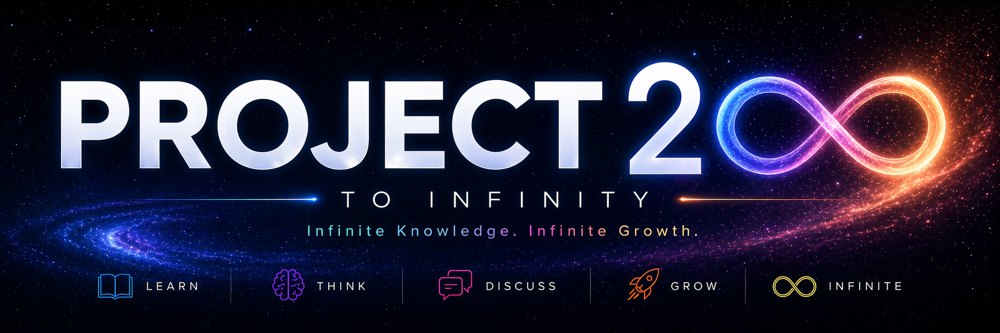

# Project 200

Project 200 is my personal learning journal — a space where I explore knowledge, ideas, and skills together with Claude Code.

I use this project to think out loud, document what I learn, test new directions, and keep building through curiosity and repetition.

Some days it starts with a small question. Other days it turns into a deep rabbit hole. Either way, this is where I keep the process.
