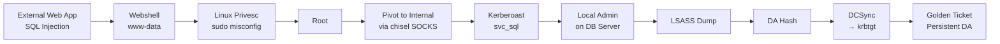

# Ch 39 — 報告寫作：exec summary、technical detail、risk rating

> 目標：Ch3 講報告的**理念與結構**，本章講報告的**實務寫作** — 工具、協作、版本控制、交付流程、常被忽略的品質細節。

## 為什麼報告要獨立兩章

Ch3 是「engagement 為什麼該以報告為中心」的 mindset。
本章是「你拿到 Word / PDF 模板，怎麼真的寫出品質可交付的文件」。

新手常見：技術搞定了，報告時間都拿來抓字、對格式、跟同事 merge — 這不該占那麼多時間。有工具、有流程，把寫報告的效率從 40 小時壓到 8 小時。

## 報告寫作工具鏈

### 選一：Word / Google Docs

最直觀。但：
- 大型 engagement 常需要多人協作 merge，Word 崩
- 版本控制靠檔名（`report_v1_final_FINAL.docx`）— 災難
- 跨 engagement 模板重用痛苦
- Code block 格式永遠怪

### 選二：Markdown + Pandoc

寫 `.md`，用 pandoc 轉 PDF / Word：

```bash
pandoc report.md -o report.pdf --template custom.latex \
       --toc --pdf-engine=xelatex
```

**優勢**：
- git 版本控制
- code block 自然
- 文字工具（Grep / sed）處理
- 可 script 化（自動插 finding ID、目錄）
- 多 tester 分檔寫 + merge 容易

**劣勢**：
- 客戶要 branded 美觀 PDF 需要 LaTeX 模板（初期投資）
- 表格複雜時 markdown 語法吃力

這是 **中型 pentest team 的主流**。

### 選三：Dradis / Serpico / PwnDoc / Sysreptor

專業 pentest reporting framework：

- **Dradis**：商用。支援多 tester 協作、CVSS 計算、重用 finding template library
- **Serpico**：開源（Python）。簡單直接
- **PwnDoc**：開源現代版，Vue.js 前端
- **Sysreptor**：開源 + 商用雲版，快速成長

這些工具的共同價值：
- finding template 重用（每次發現 XSS 不用從頭寫）
- 自動帶入 engagement metadata
- Team 協作無衝突
- 輸出 PDF / DOCX 一鍵

engagement team ≥ 3 人時強烈建議。

### 建議路徑

- 個人初學：Markdown + pandoc
- 2-3 人團隊：Sysreptor / PwnDoc
- 成熟團隊：Dradis 或自建
- 一次性公司內 engagement：Word + finding template library

## 三層讀者的對應段落

回顧 Ch3：exec / manager / engineer 三層。具體段落：

| 讀者 | 需讀 | 不需讀 |
|---|---|---|
| Exec | Executive Summary（1-2 頁） | 其他全部 |
| Manager | Executive Summary + Findings Summary + Remediation Roadmap | 技術細節的 payload |
| Engineer | Technical Findings（主體）+ Remediation | Exec Summary |

**段落順序**要讓三層讀者都能**跳著讀**：

```
1. Executive Summary        ← Exec 只看這
2. Scope & Methodology     ← 法務 / compliance
3. Findings Summary        ← Manager 看完這決定資源
4. Technical Findings      ← Engineer 讀自己負責的部分
5. Attack Chain Diagrams   ← Manager + Engineer
6. Remediation Roadmap     ← Manager 排期
7. Appendices             ← Engineer 深入
```

## Executive Summary 的結構化寫法

回到 Ch3 的例子。把「好的 Exec Summary」結構化：

```
第一段：一句話結論
  「本次測試發現 X 條導致完整接管的攻擊鏈。
   在 [天數] 內，攻擊者僅需 [簡要條件] 即可取得 [最大影響]。」

第二段：關鍵發現（3-5 條）
  每條格式：
    [業務影響] + [前提] + [推薦處置時程]
  
例：「AD 憑證體系允許任何員工取得所有系統存取權 —
     透過公開的 Kerberoasting 技術，攻擊者可在數小時內
     從單一員工帳號升級為網域管理員。建議 60 天內
     實施分層管理員架構。」

第三段：風險分布圖
  [圖] Critical × 3, High × 5, Medium × 12, Low × 8
  （比文字列表有感）

第四段：建議處置
  短期 (30 天)：前三項 Critical
  中期 (90 天)：結構性改善（tiered admin / LAPS 部署）
  長期 (1 年)：文化 / 流程 / 人
```

## Finding 的命名原則

每個 finding 有可記憶的標題。爛標題：

```
❌ Finding 003: SQL Injection
❌ Finding 005: Access Control Issue
❌ Finding 012: Information Disclosure
```

好標題：

```
✅ Finding 003: 訂單 API 的 SQLi 允許直接取得客戶資料庫全部內容
✅ Finding 005: 員工可繞過核准流程直接提升至管理員權限
✅ Finding 012: 客戶信用卡號透過錯誤訊息完整洩漏
```

**標題要同時有漏洞類型 + 業務影響**。讀者 skim 標題時能秒懂嚴重程度。

## 風險評分：CVSS 不是終點

Ch3 已經講過 CVSS 不夠。實務做法：

### 建立你的環境加權

```
Base CVSS = 掃描器 / NVD 給的
↓
Environmental Adjustment:
  - 該 asset 業務重要性 (C.R / I.R / A.R)
  - 是否對外
  - 是否含敏感資料
↓
Your Final Severity: Critical / High / Medium / Low / Info
```

自己訂 final rating 規則，寫進報告 appendix「評分方法」。客戶才能 understand 你為什麼 CVSS 7.5 卻標 Critical（因為該系統是財務）。

### 複合攻擊的評分

四個 Medium 組成 Critical 的情況：

```
✅ 每個 finding 個別評（Medium）
✅ Attack chain 整體評（Critical）
✅ 報告明確說「單項 Medium，組合 Critical」
```

組合分數寫在 Attack Chain Diagram 那一節，不把個別 finding 強行升分。

## Remediation 的寫法進階

Ch3 寫過基本版（具體、分層、驗證）。額外幾點：

### 1. 分層要真的能分

```
❌ Immediate: "升級 Apache"
   Proper:    "升級 Apache + patch CVE-XXXX"
   Long-term: "建立 patch management"
```

這三個只是同件事的不同包裝。

```
✅ Immediate (24 hours): 
   - 在 nginx 前端加入 request filter 擋 `../` 路徑（temporary WAF rule）
   
Proper (2 weeks):
   - 升級 Apache 到 2.4.54+ 修補 CVE
   - 移除不必要的 mod_cgi 模組
   - 加入 regression test 驗證 patch 生效

Long-term (quarterly):
   - 建立 automated patch pipeline
   - 訂閱 Apache security advisory
   - 季度 vulnerability scan 導入 KPI
```

短期是**工程解**，proper 是**正確處置**，long-term 是**組織改變**。真的不同層。

### 2. Verification 明確

每個 remediation 附「怎麼確認修好了」：

```
Verification:
  $ curl -I "https://target.com/cgi-bin/.%2e/etc/passwd"
  預期: HTTP 403 或 404
  （修補前: HTTP 200 + 檔案內容）
```

engineer 修好之後**自己能測**，不用再找你。

### 3. 連結 documentation

```
References:
  - MITRE ATT&CK T1190
  - CVE-2021-41773: https://nvd.nist.gov/vuln/detail/CVE-2021-41773
  - Apache Security Advisory: https://httpd.apache.org/security/vulnerabilities_24.html
  - Client internal: <your company security policy section X>
```

## Attack Chain Diagram 的實作

技術報告最被低估的元素。工具：

- **Draw.io** (diagrams.net)：免費、簡單
- **Excalidraw**：手繪風格，講故事感
- **Mermaid**：markdown 內嵌
- **BloodHound screenshot**：真實 path 直接貼

Mermaid 範例：



放在 Exec Summary 附近，讓所有讀者一眼看清 impact scale。

## 協作與版本控制

### Git-based workflow

```
pentest-reports/
├── engagement-2026-04-client-x/
│   ├── metadata.yaml
│   ├── 01-exec-summary.md
│   ├── 02-scope.md
│   ├── 03-findings-summary.md
│   ├── 04-findings/
│   │   ├── F-001-sqli-orders.md
│   │   ├── F-002-xss-search.md
│   │   ├── F-003-adcs-esc1.md
│   │   └── ...
│   ├── 05-attack-chains.md
│   ├── 06-remediation.md
│   ├── appendix/
│   ├── evidence/            # 截圖 / videos
│   │   ├── F-001-sqli.png
│   │   └── ...
│   └── build.sh             # pandoc / 腳本
```

每個 finding 獨立檔，多人可 parallel 編輯無 conflict。Git 追每改動。

### Build pipeline

```bash
#!/bin/bash
# build.sh
cat 01-*.md 02-*.md 03-*.md 04-findings/*.md 05-*.md 06-*.md > full.md
pandoc full.md -o output/report.pdf \
       --template templates/client-brand.latex \
       --toc \
       --pdf-engine=xelatex \
       --metadata-file=metadata.yaml
```

一個指令產 PDF。客戶要修正、加入截圖、改字，重 build。

## 常見報告品質問題

### 問題 1: 過度技術

```
❌ "The target endpoint is vulnerable to CVE-2021-XXXX due to improper 
    input sanitization in the deserializer resulting in arbitrary code 
    execution via gadget chain B.."
```

Manager 看不懂。改寫：

```
✅ "訂單 API 存在嚴重漏洞，允許攻擊者直接在伺服器上執行任意程式 — 
    包括讀取客戶資料、下載全部資料庫、或破壞系統。此為已知的 
    Java 序列化漏洞 (CVE-2021-XXXX)。技術細節見附錄。"
```

### 問題 2: 不區分事實與推論

```
❌ "We found SQL injection, which means the entire database can be 
    compromised, which could cost millions of dollars in damages."
```

推論太跳。改：

```
✅ 事實: SQL injection 存在於 /api/search
   PoC 驗證: 成功取得 users 表的 schema（3 欄位）
   影響評估:
     - 已確認: 可讀 users 表 schema
     - 可能但未執行: 可讀完整 users 表（含 email、hash）
     - 若被真實攻擊者利用: 客戶資料外洩風險，依 GDPR 最高罰款 2000 萬歐元
```

事實、已驗證、未驗證、假設影響分開寫。

### 問題 3: Evidence 不足

每個 Critical / High finding **必須有**：
- 原始 request（curl 指令或完整 HTTP request）
- 原始 response（截圖或 raw）
- 後續影響的 PoC（「成功取得 X」的截圖）

Low / Info 可以只有文字描述 + 一張截圖。

### 問題 4: 忽略「好的發現」

報告不只寫問題。寫：

```
Observed Positive Controls:
- Strong password policy (14 char min) enforced
- MFA deployed across all admin accounts
- LAPS deployed on all workstations
- Patch level generally current (most systems < 30 days old)
```

這讓客戶感受到報告的平衡，也讓他們知道「別改錯」— 例如若你沒提 MFA 有效，客戶可能認為 MFA 也要重新評估。

## 配合 ATT&CK 標註

每個 finding 標 MITRE ATT&CK TTP：

```
Finding: Kerberoasting of svc_sql
ATT&CK:  T1558.003 - Steal or Forge Kerberos Tickets: Kerberoasting
```

整份報告整理成「本次 engagement 觸及的 ATT&CK technique 矩陣」appendix：

```
Tactic: Credential Access
  T1558.003 - Kerberoasting (F-003)
  T1003.002 - OS Credential Dumping: SAM (F-015)
  T1003.006 - DCSync (F-020)
Tactic: Lateral Movement
  T1021.002 - SMB/Windows Admin Shares (F-012)
  ...
```

讓客戶 SIEM team 能用你的 report 直接 audit detection 覆蓋率。是超高 ROI 的 appendix。

## 客戶 Walkthrough 會議

Ch3 提過。本章補細節：

### 議程範例（90 分鐘）

```
10 min  - Opening / engagement recap
15 min  - Exec Summary walkthrough
25 min  - Top 3 Critical findings 逐條討論
20 min  - Attack chain demo（video / live）
10 min  - Q&A
10 min  - Next steps（retest timeline）
```

### 準備事項

- PowerPoint 版本的 Exec Summary（重點視覺化）
- 2-3 個最具衝擊力的 PoC 影片預錄
- 每個 finding 的「為什麼重要」一分鐘版本（客戶可能跳問）
- 客戶方預期參加者名單 → 準備對應層次的細節

## 交付物 checklist

Engagement 結束時客戶應收到：

```
□ PDF 報告（主檔）
□ DOCX 版本（若客戶要改）
□ Executive Summary 單獨 PDF（給高層）
□ Findings CSV（給 issue tracker import）
□ 所有 evidence（截圖 / video）打包
□ Resource script / reproduction data
□ ATT&CK mapping JSON（給 SIEM team）
□ Retest plan proposal
```

## 保密與資料銷毀

Ch1 講過。報告交付後：

- 你的 VM 上所有客戶資料（含 hash、dump、內部 URL 列表）需要銷毀
- 計畫性 schedule（例如交付 + 30 天）
- 銷毀後給客戶證明（email confirmation）

**不要留客戶 credential 超過必要期**。hash 在你機器上放三個月 = 你現在是客戶的風險。

## 心法：報告是 engagement 的結晶

engagement 過程中蒐集的所有資料、繞過的技術、成功與失敗的實驗 — 報告是**壓縮成客戶可行動的形式**。

壓縮失敗 = 客戶看不懂 → 不修 → 下次被真的打 → 你 engagement 零價值。

壓縮成功 = 客戶讀完有具體行動 → 修好 → 下次 engagement 確實較難 → 你的工作有累積。

這是為什麼報告寫作佔 engagement 時間 25%+ 並不誇張。

## 自我檢核

- [ ] 我能選擇適合我團隊規模的報告工具鏈
- [ ] 我能把報告段落對應到 exec / manager / engineer 三層
- [ ] 我能寫一份 2 頁以內的 Exec Summary 不遺漏關鍵
- [ ] 我能把 remediation 真的分層（immediate / proper / long-term 非重複）
- [ ] 我能畫 Attack Chain Diagram
- [ ] 我能用 git + markdown + pandoc 建立可重複 report build
- [ ] 我能主持報告 walkthrough 會議
- [ ] 我能按期銷毀客戶資料

最後一章 — engagement 閉環：重測、修補驗證、關單。

→ [Ch 40 重測、修補驗證、engagement 閉環](./40-retest-closeout.md)
