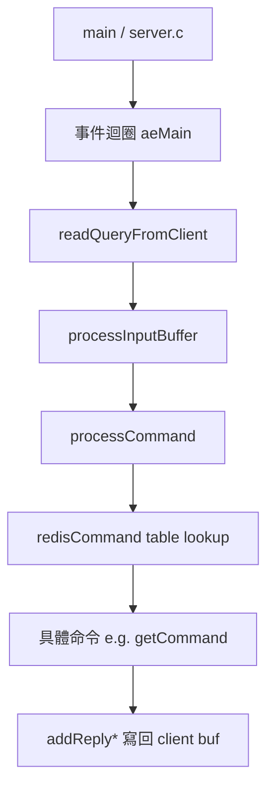
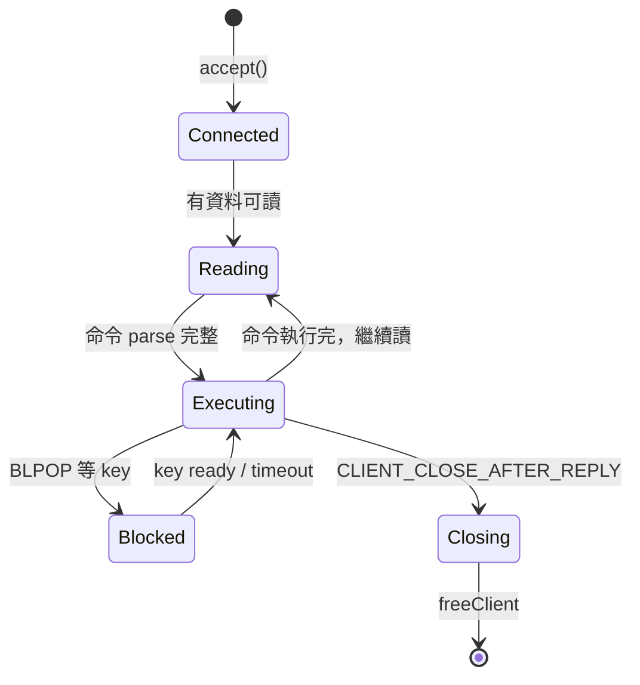
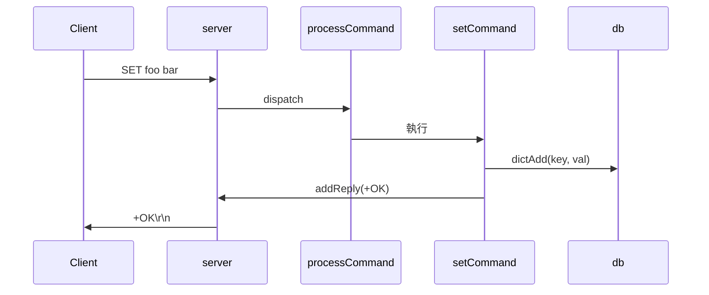

# Ch 35 — 外化理解：筆記、圖、心智模型

> **目標**：把「讀碼」從一個「在腦中進行的活動」變成一個「在紙上/檔案裡進行的活動」。理由是硬的認知科學：工作記憶就那麼大（呼應 Ch 3），你越想在腦中同時 hold 住十個 struct 欄位、五條呼叫鏈、三個待驗證的假設，你越讀不動。外化 = 把工作記憶 offload 到外部媒介，騰出腦力給真正的理解。讀完你有一套可直接抄的筆記模板、畫圖決策樹，和「把理解釘回 code」的手法。

## 為什麼「腦中讀」是輸家策略

先講一個你八成親身經歷過、但沒歸因對的場景：**你讀一個函式讀到一半，去追它呼叫的另一個函式，追完回來，發現忘了自己剛剛在原函式讀到哪、在想什麼。** 於是你重讀。這一天你重讀了同一段 code 五次。

這不是你不專心，是**工作記憶溢位**。Ch 3 講過，人的工作記憶大約只能同時 hold 4±1 個「chunk」。而讀陌生 code 時，每一個你還沒消化的東西——一個沒見過的 struct、一條沒追完的呼叫、一個「這裡為什麼要判這個」的疑問——都佔一個 slot。陌生 code 之所以累，就是因為它瞬間塞爆你的 4 個 slot，逼你不停地把東西「換出」再「換入」，而換出的東西如果沒寫下來，就是**永久遺失，只能重讀重建**。

外化的整個立論就一句話：

> **工作記憶是稀缺、易失的暫存器；紙筆/檔案是廉價、持久的記憶體。把該存的東西存到後者，前者才有空間跑「理解」這個運算。**

這不是「勤勞的人才做筆記」的道德勸說，是**架構上的必然**。專家讀碼看起來「用腦」很省力，很大一部分是因為他們把大量狀態外化了——只是有些人外化到白板、有些人外化到編輯器的一堆註解、有些人外化到一張隨手畫的圖。他們不是記憶力好，是**不依賴記憶力**。

## 底層機制：外化到底 offload 了什麼

外化不是「把看到的抄一遍」——那是浪費時間。有價值的外化是把**你腦中正在耗費工作記憶去維持的東西**倒出來。具體是三類：

1. **未解的疑問（open questions）**：「這個 `flags` 的第 3 位是幹嘛的？」「這裡為什麼不用鎖？」——每一個懸而未決的疑問都佔一個 slot，而且會不斷偷走你的注意力（Zeigarnik effect：未完成的事會一直在腦中冒泡）。寫下來，它就從「一直在背景嗡嗡響的執行緒」變成「清單上一個之後再處理的項目」，slot 立刻釋放。
2. **待驗證的假設（hypotheses）**：「我猜這個函式是在做 LRU 淘汰」——假設是 Ch 10 的核心武器，但假設在腦中會悄悄「硬化成事實」而你沒察覺。寫下來並標「未驗證」，逼你之後回來查證，避免建立在錯假設上的整棟理解崩塌。
3. **已確認的發現（findings）**：「確認了：`c->flags & CLIENT_BLOCKED` 表示這個 client 卡在等 key」——這是你辛苦挖出來的結論。不外化，下次還要重挖。

這三類正好對應下面第一個、也是最重要的模板。

## 模板一：三欄式 reading journal

這是我最推的外化工具，因為它直接對映上面三類 offload。開一個 markdown 檔（`reading-notes.md`），維護三個區塊：

```markdown
# 讀碼筆記：<專案/模組名>  <日期>

## 假設（Hypotheses）— 我猜，待驗證
- [ ] H1: server.c 的 aeMain 是唯一主迴圈，所有 client 事件都從這裡分派
- [ ] H2: c->querybuf 存的是還沒 parse 完的原始輸入位元組
- [x] H3: processCommand 是命令分派的中心 —— 已驗證，見 F2

## 問題（Questions）— 還不懂，待查
- [ ] Q1: freeClientAsync vs freeClient 差在哪？為什麼要 async 版？
- [ ] Q2: CLIENT_CLOSE_AFTER_REPLY 這個 flag 誰設、誰清？
- [x] Q3: RESP3 的 map 回覆怎麼編碼？—— 見 addReplyMapLen，已解

## 發現（Findings）— 確認了，帶證據
- F1: 主迴圈在 server.c:7251 `aeMain(server.el)`（cscope 反查確認唯一呼叫）
- F2: 命令表是 struct redisCommand[]，dispatch 靠 lookupCommand() 查 dict
- F3: 每個 client 一個 struct client，欄位 querybuf/buf/reply 分別是 in/out/pending
```

用法要點：

- **三欄會互相流動**：一個「問題」查清楚了，搬去「發現」並打勾；一個「假設」驗證了，同上；一個「發現」讓你冒出新疑問，加進「問題」。這個流動本身就是你理解在推進的可視化。
- **每條發現帶證據**（哪個檔哪行、哪個工具查到的）。無證據的「發現」是偽裝成事實的假設，最危險。
- **用 checkbox**。未打勾的項目是你的 backlog，一眼看到「還有多少沒搞懂」，也防止你以為自己懂了其實有一堆懸案。
- **這份檔就是你的 offload 目標**。讀到一半要去追別的函式前，先把「我剛在想什麼」丟進對應欄，回來直接讀檔續上，不必重建。

## 模板二：畫圖——選對圖型

文字筆記擅長記「離散的事實」，但 code 的**關係與結構**用文字記極其低效——「A 呼叫 B，B 呼叫 C 和 D，C 又回頭改 A 的狀態」你讀三遍都繞不清，畫成圖一眼懂。關鍵是**選對圖型**。這是一張決策表：

| 你想搞懂的東西 | 該畫的圖 | 一句話 |
|---|---|---|
| 模組/元件怎麼組合 | **架構圖**（方塊 + 箭頭） | 誰包含誰、誰依賴誰的靜態結構 |
| 一個功能的執行步驟 | **流程圖 / sequence 圖** | 從 A 到 Z 依時間順序發生什麼 |
| 一個物件的生命週期 | **狀態圖（state machine）** | 有哪些狀態、什麼事件觸發轉移 |
| 一個複雜的 struct | **資料結構圖** | 欄位、指標指向、記憶體佈局 |
| 誰呼叫誰 | **call graph** | 函式間的呼叫關係（Ch 9 已談，cflow 可自動生） |

實務上我最常用 **mermaid**——因為它是純文字，可以直接寫進你的 markdown 筆記、進 git、跟 code 一起版本控制。不必開繪圖軟體，打字就出圖。幾個現成可抄的骨架：

**架構圖（redis 為例，示意）：**


**狀態圖（一個 client 的生命週期，示意）：**


**sequence 圖（追一條請求路徑，示意）：**


畫圖的兩個心法：

1. **圖要「夠用就好」，不是工程文件**。你畫圖是為了 offload 自己腦中的關係，不是給別人看的正式文檔。畫得醜、只畫你正在搞的那五個方塊、標註隨手寫——完全沒關係。**一畫完就發現理解對不上**才是圖最大的價值：你畫到一半發現「欸，這個箭頭我畫不出來，因為我根本不知道 B 怎麼回到 A」——那個畫不出來的地方，就是你沒懂的洞（這直接呼應下一章費曼測試）。
2. **用工具自動生一版當底稿**。call graph 別手畫，用 cflow + graphviz（Ch 16）自動生，再手動刪繁留簡。自動生的圖太雜，但當你「校對自己手繪圖」的參照物很好用。

## 模板三：把理解「釘回」code——註解考古與重命名

前兩個模板把理解外化到**旁邊的檔案**。這個模板更進一步：把理解外化**回 code 本身**。這在讀碼上有個獨特優勢——**理解就長在它該在的地方，下次（你或別人）讀到這行時，理解直接送到眼前，不必翻筆記。**

三個具體手法：

1. **旁註 / 註解考古**：你辛苦搞懂了一段沒註解的硬核 code，**當場把結論寫成註解**。這叫「註解考古」——你像考古學家一樣挖出了這段 code 的含義，把它記錄在遺址旁。
   ```c
   /* 我讀懂後補的：這裡的 & 3 是取 encoding 的低 2 bit，
    * 0=RAW 1=INT 2=EMBSTR，見 object.c 的 OBJ_ENCODING_* 定義 */
   int enc = o->encoding & 3;
   ```
   即使你在讀的是別人的、唯讀的 codebase，你也可以 clone 一份自己改著玩——這些註解是你未來重讀時的最大加速器。**如果這是你要貢獻/維護的 code，這些註解甚至可以變成 PR**（接 open_source 課）。

2. **重命名釘住理解**：讀到一個叫 `tmp` / `x` / `p2` 的變數，你花了十分鐘才搞懂它其實是「上一個未過期的節點」——**立刻把它重命名成 `lastUnexpiredNode`**（在你的實驗 clone 裡）。名字是最省力的文件：改一次名，之後這個變數每次出現都在替你複習理解，不必記「p2 是什麼」。LSP 的 rename 重構（Ch 13）能安全地一次改掉所有引用。

3. **加型別 / 加 assert 釘住不變式**：你推斷出「這裡的 `len` 一定 > 0」，就加一行 `assert(len > 0)`——這既把你的理解固化成可執行的檢查，又能在你**理解錯了**的時候（跑起來 assert 爆掉）當場糾正你。這是「外化 + 自我驗證」二合一。

這三個手法的共同精神：**把稍縱即逝的理解，固定成 code 裡的持久物件（註解/名字/斷言）**。理解一旦釘進 code，就不會因為你關掉編輯器而蒸發。

## 真跑：一份筆記在讀碼中「流動」的樣子

模板看起來很靜態，但外化的價值在**動態**——三欄之間的流動就是你理解推進的軌跡。我們模擬讀 redis「一個 client 送 `GET foo` 到收到回覆」這條路徑時，筆記的三個時間切片，讓你看到它怎麼長出來。

**T0（剛開檔，一片茫然）：**
```markdown
## 假設
- [ ] H1: 所有 client 事件都從 aeMain 的事件迴圈進來
## 問題
- [ ] Q1: 一個命令的位元組進來後，第一個碰它的函式是誰？
- [ ] Q2: querybuf 是什麼？在哪被填？
## 發現
（空）
```

**T1（cscope 反查 + 讀了 networking.c 一陣）：**
```markdown
## 假設
- [x] H1: 已驗證 —— readQueryFromClient 是 read handler，見 F1
- [ ] H2: 命令 parse 和 dispatch 是分開兩步（parse 成 argv，再查表執行）
## 問題
- [ ] Q1: → 已解，見 F1
- [ ] Q2: → 已解，見 F2
- [ ] Q3: RESP inline vs multibulk 兩種格式怎麼分流的？（新冒出來的）
## 發現
- F1: readQueryFromClient (networking.c) 是 client 可讀時的 handler，把 socket 資料讀進 c->querybuf
- F2: c->querybuf = 累積的原始輸入位元組，processInputBuffer 從這裡 parse
```

**T2（追完 processCommand）：**
```markdown
## 假設
- [x] H2: 已驗證 —— processInputBuffer parse 成 c->argv[]，processCommand 查表執行，見 F3/F4
## 問題
- [x] Q3: → processInputBuffer 看首位元組是不是 '*' 決定走 multibulk 還是 inline，見 F3
## 發現
- F3: processInputBuffer 依首字元分流；multibulk → processMultibulkBuffer 填 c->argv
- F4: processCommand → lookupCommand(argv[0]) 查 dict 拿 redisCommand，再 c->cmd->proc(c) 執行
- F5: getCommand (t_string.c) 是 GET 的實作，addReply* 把結果寫回 c->buf
```

三個切片攤在一起，你看到的不只是「一堆事實」，而是**理解生長的過程**：H1 被證實、Q2 被解答、Q3 中途冒出又被解決、假設 H2 從模糊猜測變成帶證據的 F3/F4。**這份筆記本身就是你這次讀碼的完整心智軌跡**——半年後回來，照著它五分鐘就能重建，不必重讀。而如果你全程「腦中讀」，這條軌跡讀完就蒸發，下次歸零。

（你不必照抄這些函式名——重點是感受「三欄如何互相流動」。真要驗證，`rg -n "readQueryFromClient|processInputBuffer|processCommand" src/*.c` 自己走一遍。）

## 對比與取捨

| 外化媒介 | 最適合 offload | 優點 | 缺點 |
|---|---|---|---|
| 三欄筆記（markdown） | 假設/問題/發現等離散事實 | 可搜尋、進 git、易維護 | 表達不了複雜關係 |
| mermaid 圖（文字生圖） | 結構、流程、狀態、關係 | 純文字進版控、跟 code 同源 | 大圖會亂，需手工裁剪 |
| excalidraw / 白板 / 紙筆 | 探索期的自由塗鴉、臨時關係 | 零摩擦、最快、最自由 | 不進版控、易丟、難搜尋 |
| 釘回 code（註解/重命名/assert） | 「這行/這變數到底是什麼」 | 理解長在該在的地方、可變 PR | 需要能改 code（clone 一份） |

**實戰組合**：探索初期用**紙筆/白板**快速塗鴉建立粗略心智模型（摩擦最低，允許亂）→ 穩定後把值得留的關係謄成 **mermaid** 進筆記檔 → 離散事實/假設/問題進**三欄筆記** → 每搞懂一塊具體 code 就順手**釘回 code**（重命名/註解/assert）。四者不是選一個，是分工。

一個常見的取捨誤區：**過度外化 = 抄書**。如果你把每一行 code 都翻譯成中文寫進筆記，你只是在浪費時間，沒 offload 任何東西（那些 code 本來就在檔案裡，隨時能看）。**只外化「腦中正在耗工作記憶維持的東西」**——疑問、假設、跨檔的關係、辛苦挖出的結論。看一眼就懂、隨時能重查的東西不必抄。

## 好外化 vs 壞外化：兩份筆記的對照

同樣是「做筆記」，做對和做錯的差距是天與地。並排看兩份讀同一段 code 的筆記：

**壞外化（抄書式，沒 offload 任何東西）：**
```
processCommand 函式：
  先呼叫 lookupCommand
  然後檢查 authenticated
  然後檢查 OOM
  然後檢查 cluster redirect
  然後 call proc
（把 code 的結構原樣抄一遍，沒有任何「我不懂/我猜/我發現」）
```
這份筆記毫無價值——它只是把 code 換行重排了一次，你隨時能打開 `server.c` 看到一模一樣的東西。它沒 offload 你腦中任何正在耗工作記憶的東西，純粹浪費時間。

**好外化（offload 了真正該存的）：**
```
## 問題
- [ ] 這些前置檢查的順序有講究嗎？為什麼 auth 在 OOM 前面？
      （猜：未認證的人不該讓他觸發任何昂貴檢查？待查）
## 發現
- F: processCommand 是「守門員」——真正執行前有一長串 gate，
     任一 gate 擋下就 addReply 錯誤 + return，不會走到 c->cmd->proc
- F: proc 是函式指標 (c->cmd->proc)，具體命令在 command table 註冊 —— 
     這就是 redis 的 dispatch 機制，跟我在 kernel 看過的 syscall table 同構
```
這份筆記記的全是**code 裡看不到、只存在你腦中的東西**：一個關於順序的疑問、一個「守門員」的心智模型、一個跟你既有知識（syscall table）的類比。這些不寫下來就會流失，寫下來就是資產。**判準永遠是：這條筆記如果從 code 直接能讀到，就不該出現在筆記裡。**

## 踩雷集錦

1. **錯誤直覺：「我記性好，用腦記就行，做筆記是浪費時間。」** 正確認識：這跟記性無關，是工作記憶的物理上限（4±1 chunk）。你「記性好」頂多讓 slot 從 4 變 5，面對塞爆 50 個 chunk 的陌生 code 一樣溢位。外化不是給記性差的人的拐杖，是所有人對抗架構性限制的必要手段。專家外化得比你多，不是少。

2. **錯誤直覺：「等我讀懂了再做筆記/畫圖，現在還一團亂沒法記。」** 正確認識：**正好相反**。外化是**幫你讀懂的工具**，不是「讀懂後的記錄」。一團亂的時候最該畫圖——畫的過程逼你把亂的關係理出來，畫不出來的地方就是你的洞。等「讀懂了」才記，你已經浪費了整個理解過程中最需要外化的階段。

3. **錯誤直覺：「假設寫下來跟記在腦裡沒差。」** 正確認識：差在**「未驗證」這個標記**。腦中的假設會在你沒察覺時悄悄變成「事實」，然後你把整棟理解蓋在沙子上。寫下來並顯式標 `[ ] 未驗證`，才逼你回來查證。外化假設的核心價值不是「記住它」，是「標記它還沒被證實」。

4. **錯誤直覺：「圖要畫得完整、漂亮、涵蓋全部。」** 正確認識：讀碼的圖是**用完即棄的思考輔具**，不是交付文檔。只畫你此刻正在搞的那幾個方塊，醜、局部、隨手標註都行。追求完整漂亮會讓你花在排版上的時間超過理解，本末倒置。

5. **錯誤直覺：「別人的 codebase 我不能改，所以沒法『釘回 code』。」** 正確認識：clone 一份自己的實驗副本，隨便改。重命名、加註解、加 assert——這些改動幫你理解，不必 merge 回上游（要的話更好，變 PR）。「不能動生產 code」不等於「不能動你手上的讀碼副本」。

6. **錯誤直覺：「外化越多越好，全部抄下來最安全。」** 正確認識：抄書式外化是純浪費——那些內容本來就在 code 裡隨時能查。有效外化只針對「腦中正在耗工作記憶的東西」。判準：**這個東西如果不寫下來，我會不會在追別的東西時把它忘掉、之後得重挖？** 會 → 外化；不會（隨時能重查且很快）→ 別抄。

## 進階：再往深一層

- **外化即思考（reflective externalization）**：認知科學裡「distributed cognition」與「external representation」的研究指出，人解決複雜問題時，外部表徵（紙上的圖、排開的卡片）不只是「儲存」，它本身參與運算——你移動、對齊、連線這些外部物件時，是在用手替大腦分擔推理。所以畫圖不是「把想法畫出來」，畫的動作本身在幫你想。這是「先畫再懂」而非「先懂再畫」的深層理由。
- **筆記的複利**：一份好的讀碼筆記在你**第二次回到這個 codebase** 時價值爆發——半年後你回來改 bug，翻出當初的三欄筆記和架構圖，五分鐘重建心智模型，而不是從零重讀。把讀碼筆記當資產累積（一個專案一個檔，進 git），是資深工程師和「每次都從頭讀」的人的長期差距來源。
- **團隊層級的外化**：你的個人筆記整理乾淨後，往往就是團隊缺失的 onboarding 文件、架構決策紀錄（ADR）、或 code 裡該有卻沒有的註解。把個人外化升級成團隊外化，是把「我讀懂了」變成「我讓後面的人不必再痛一次」——這是 Ch 36 費曼測試「能教會別人」的組織版。
- **AI 輔助的外化**（接 Ch 20）：讓 LLM 幫你把一段 code 生成初版的 mermaid 圖或摘要，你再校對修正——校對的過程比從零畫更快，且校對時你反而讀得更仔細（因為要抓 AI 的錯）。但務必自己校對：AI 生成的圖會有幻覺的箭頭，未經驗證的圖比沒有圖更危險。

## 動手練習

1. **建三欄筆記讀 redis client 生命週期**：開 `reading-notes.md`，用三欄模板，讀 `src/networking.c` 裡 client 從建立到釋放的流程。強制自己：每追一個函式前先把「我在想什麼」丟進對應欄，至少產出 5 個假設、5 個問題、5 個發現，並讓其中幾個在讀的過程中「流動」（問題→發現、假設→驗證）。
2. **畫 client 狀態圖**：根據上面的閱讀，用 mermaid `stateDiagram-v2` 畫出一個 client 的狀態機（至少涵蓋 connected/reading/executing/blocked/closing）。畫的過程中，記下每一個「我畫不出這個轉移，因為我不確定」的地方——那些就是你的理解洞。
3. **釘回 code**：clone 一份 redis，挑 `src/object.c` 裡一段你覺得晦澀的 encoding 處理，做三件事：(a) 把一個爛名字變數重命名成表意的名字，(b) 在一段你搞懂的邏輯上補一句「我讀懂後補的」註解，(c) 在一個你推斷出的不變式處加一個 `assert`。體會理解「長在 code 裡」的感覺。
4. **自動生圖 vs 手繪圖對照**：用 `cflow --depth=3 -m processCommand src/server.c` 自動生一版 call graph，跟你手繪的架構圖對照，找出你手繪時漏掉或畫錯的呼叫關係。體會「自動生圖當校對參照」。
5. **反思外化的邊界**：回顧你上面做的筆記，圈出哪些是「有效 offload」（不寫會忘、得重挖），哪些其實是「抄書」（隨時能重查）。刪掉抄書的部分，感受「只外化該外化的」。

## 本章重點整理

- 腦中讀是輸家策略：工作記憶只有 4±1 chunk，陌生 code 瞬間塞爆，沒外化的東西 = 永久遺失、只能重讀。
- 外化 = 把易失的工作記憶 offload 到持久的外部媒介，騰出腦力跑「理解」。這是架構必然，不是勤勞美德。
- 該外化三類：未解疑問、待驗證假設、已確認發現（帶證據）。不該外化：隨時能重查、不寫也不會忘的東西。
- 三欄筆記（假設/問題/發現）+ 選對圖型（架構/流程/狀態/資料結構/call graph，用 mermaid 進版控）+ 釘回 code（重命名/註解/assert）。
- 畫圖是「先畫再懂」的思考輔具，不是「先懂再畫」的文檔；畫不出來的地方就是你的理解洞。
- 假設外化的關鍵價值是「未驗證」標記，防止假設在腦中悄悄硬化成事實。
- 好筆記有複利：第二次回到 codebase 時價值爆發；個人外化可升級成團隊 onboarding 文件。

## 自我檢核

- [ ] 不看筆記，你能用「工作記憶上限」解釋為什麼腦中讀碼會讓你反覆重讀同一段嗎？
- [ ] 三欄筆記是哪三欄？它們各對映你腦中哪一類正在耗工作記憶的東西？
- [ ] 給你「搞懂一個 struct 的欄位指向」「搞懂一個功能的執行步驟」「搞懂一個物件的生命週期」，你分別該畫哪種圖？
- [ ] 為什麼說「畫不出來的箭頭就是你沒懂的洞」？這跟下一章的費曼測試有什麼關係？
- [ ] 「釘回 code」有哪三個手法？在唯讀的別人 codebase 上你要怎麼做？
- [ ] 怎麼區分「有效外化」和「抄書式浪費」？判準是什麼？

## 延伸閱讀

- **《The Programmer's Brain》— Felienne Hermans（Manning, 2021）**
  - **讀哪幾章**：講 working memory 與 chunking 的第 1–3 章，以及談「怎麼記與外化」的相關章節。
  - **學到什麼**：本章「工作記憶 offload」的認知科學基礎。書裡有具體實驗數據支撐「為什麼陌生 code 塞爆你的腦」，讀完你會把外化當成不可協商的必需品而非可選項。
  - **前提**：無。這也是全課 Part 1 的主要參考書。

- **[Mermaid 官方文件](https://mermaid.js.org/intro/)**
  - **讀哪裡**："Flowchart"、"Sequence Diagram"、"State Diagram" 三份語法頁，各看範例即可，當字典查。
  - **學到什麼**：用純文字生出架構/流程/狀態圖的完整語法。重點是它能寫進 markdown、進 git、跟 code 同源版本控——這是它勝過白板塗鴉的關鍵，讓你的圖不會丟失。
  - **前提**：無。GitHub / GitLab 的 markdown 都直接渲染 mermaid，寫了立刻看得到圖。

- **Andy Hunt, 《Pragmatic Thinking & Learning》— 談 external representation 與 note-taking 的章節**
  - **讀哪裡**：講「用外部表徵輔助思考」與「reading journal / wiki 式筆記」的段落。
  - **學到什麼**：把「做筆記」從被動記錄升級成主動思考工具的方法論，以及「distributed cognition（外部物件參與運算）」的直覺。跟本章「外化即思考」的進階段互補。
  - **前提**：無。

外化把理解從腦中倒到紙上——但「倒得出來」還不等於「真的懂」。你可能寫了一堆筆記、畫了圖，卻在某個關鍵環節其實是含糊帶過的。下一章給你一把最誠實的尺，來檢驗你到底是真懂還是自以為懂：**費曼測試——能不能把它教會一個外行。**

→ [Ch 36 費曼測試](./36-feynman-test.md)
